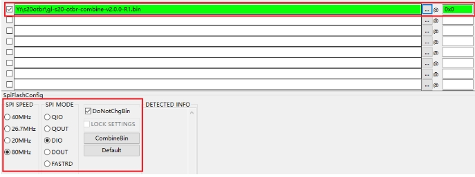

# Getting Started

## Requirements

- Ubuntu 20.04 LTS or later


## Install dependencies

### 1. Install Prerequisites

- To compile using ESP-IDF you will need to get the following packages.

  ```
  sudo apt-get install git wget flex bison gperf python3 python3-pip python3-venv cmake ninja-build ccache libffi-dev libssl-dev dfu-util libusb-1.0-0
  ```

### 2. Download esp-idf sdk

- Download esp-idf sdk.

  ```
  cd ~/
  git clone https://github.com/espressif/esp-idf.git -b v5.1.3
  cd ~/esp-idf
  git submodule update --init --recursive --progress
  ```

### 3. Set up the tools

- Aside from the ESP-IDF, you also need to install the tools used by ESP-IDF, such as the compiler, debugger, Python packages, etc, for projects supporting ESP32.

  In order to install tools for all supported targets please run the following command:

  ```
  cd ~/esp-idf
  ./install.sh all
  ```

### 4. Set up the environment variables

- The installed tools are not yet added to the PATH environment variable. To make the tools usable from the command line, some environment variables must be set. ESP-IDF provides another script which does that.

- In the terminal where you are going to use ESP-IDF, run:

  ```
  . ~/esp-idf/export.sh
  ```


More details about installation in [ESP Installation Guide](https://docs.espressif.com/projects/~/esp-idf/en/v5.1.3/esp32/get-started/linux-macos-setup.html).


## Build Thread Border Router demo for GL-S20 hardware

### building

```
git clone https://github.com/gl-inet/gl-esp-thread-br
cd gl-esp-thread-br/examples/gl_s20_thread_border_router
. ~/esp-idf/export.sh
idf.py build
```


### flashing

- Use command to generate firmware into your GL-S20

  ```
  cd gl-esp-thread-br/examples/gl_s20_thread_border_router/build
  esptool.py --chip esp32s3 merge_bin --output ../gl-s20-combine.bin $(cat ./flash_args)
  ```
  
  > It will generate a firmware file named **gl-s20-combine.bin**

- Flash the `gl-s20-combine.bin` into your GL-S20 with ESP [flash_download_tool](https://www.espressif.com/en/support/download/other-tools).

  

  > Check [guide](https://docs.gl-inet.com/iot/en/thread_board_router/gl-s20/user_manual/flash_guide/) for more details about flashing firmware to GL-S20 .


# ESP Thread Boarder Router SDK

ESP-THREAD-BR is the official [ESP Thread Border Router](https://openthread.io/guides/border-router/espressif-esp32) SDK. It supports all fundamental network features to build a Thread Border Router and integrates rich product level features for quick productization.

# Software Components


The SDK is built on top of [ESP-IDF](https://github.com/espressif/esp-idf) and [OpenThread](https://github.com/openthread/openthread). The OpenThread port and ESP Border Router implementation is provided as pre-built library in ESP-IDF.


# Provided Features

These features are currently provided by the SDK:

* **Bi-directional IPv6 Connectivity**: The devices on the backbone link (typically Wi-Fi) and the Thread network can reach each other.
* **Service Discovery Delegate**: The nodes on the Thread network can find the mDNS services on the backbone link.
* **Service Registration Server**: The nodes on the Thread network can register services to the border router for devices on the backbone link to discover.
* **Multicast Forwarding**: The devices joining the same multicast group on the backbone link and the Thread network can be reached with one single multicast.
* **NAT64**: The devices can access the IPv4 Internet via the border router.
* **RCP Update**: The built border router image will contain an updatable RCP image and can automatically update the RCP on version mismatch or RCP failure.
* **Web GUI**: The border router will enable a web server and provide some practical functions including Thread network discovery, network formation and status query. 
* **RF Coexistence**: The border router supports optional external coexistence, a feature that enhances the transmission performance when there are channel conflicts between the Wi-Fi and Thread networks.

